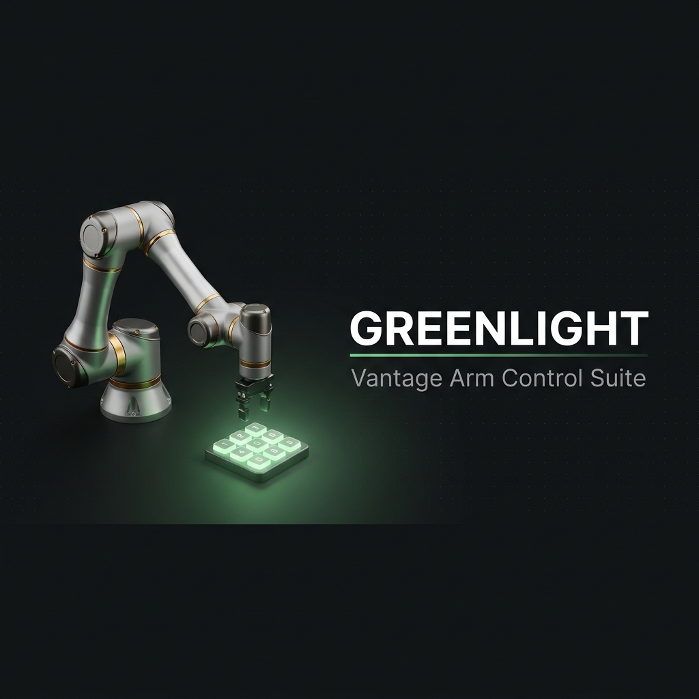
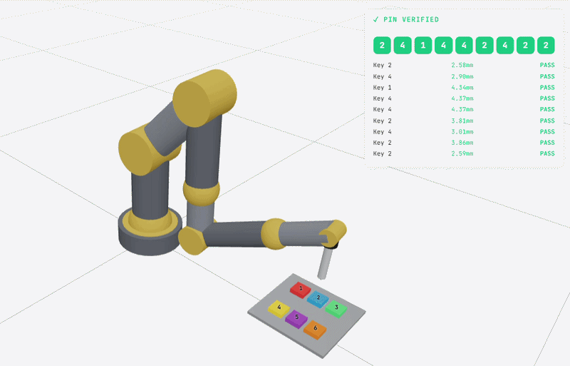
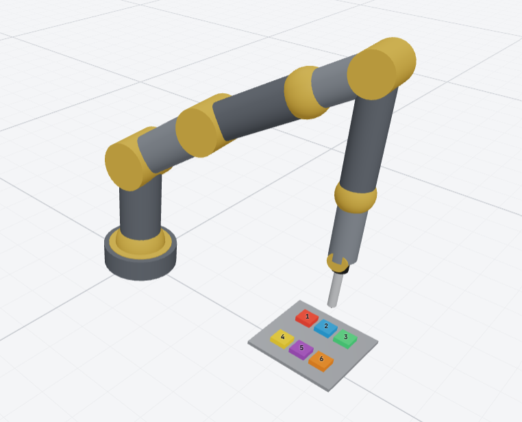
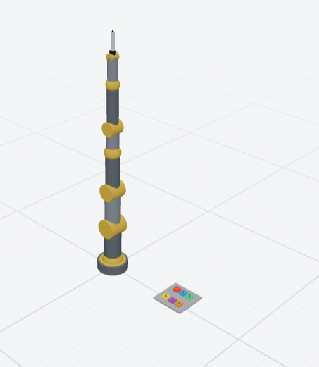
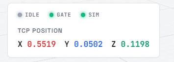
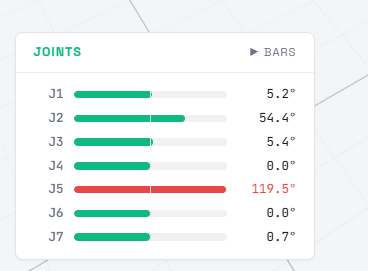
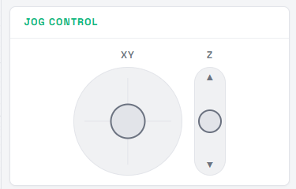
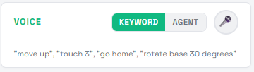
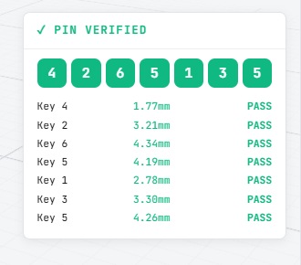

<p align="center">
  
</p>

<p align="center">
  
  
  
  
  
  
  
</p>

<br/>

<p align="center">
  <strong>A browser-based control suite for a 7-DOF robotic arm.</strong><br/>
  <sub>Inverse kinematics · Safety gating · Voice · Autonomous PIN entry · Agentic AI</sub>
</p>

<p align="center">
  <a href="https://green-light-iut-techathon-hackathon.vercel.app/"></a>
  &nbsp;
  <a href="https://wokwi.com/projects/469142896149008385"></a>
</p>

<p align="center">
  <code>6 input methods</code> · <code>1 shared pipeline</code> · <code>0 ungated paths</code>
</p>

<br/>

<p align="center">
  
</p>

<br/>

---

<br/>

## The Premise

Vantage Robotics tests every software change on a real arm — slow, risky, expensive. **Greenlight** moves that testing entirely into the browser. Engineers visualize the arm, drive it six different ways, and prove it can complete a precise task on its own — with no hardware in the loop.

> Only software that proves itself safe in simulation earns a shot on real hardware.  
> Hence the name.

<br/>

## The Core Idea

This is not six features bolted together. It is **one motion-control pipeline**, triggered six different ways.

```
  Joystick     ─┐
  Keyboard      ─┤
  Voice (KW)    ─┤                    ┌──────────┐     ┌─────────────┐     ┌──────────┐
  Voice (Agent) ─┼── MotionCommand ──▶│ Planner  │────▶│ Safety Gate │────▶│ Executor │──▶ 🦾
  Autonomous PIN─┤                    │   (IK)   │     │  (validate) │     │ (animate)│
  Agentic NL    ─┘                    └──────────┘     └─────────────┘     └──────────┘
```

Every input source emits the same `MotionCommand`. Every command passes through the same deterministic safety gate. **Nothing reaches the arm without passing the gate** — including the AI agent.

<br/>

---

<br/>

## Features

<br/>

### Visualization & Telemetry

<table>
  <tr>
    <td width="55%">
      
    </td>
    <td width="45%">
      
    </td>
  </tr>
</table>

Full URDF-loaded 7-DOF arm with real-time joint interpolation, orbit controls, reference grid, and axis gizmo. Every joint angle is driven by a single Zustand store — what you see is what the firmware would receive.

<table>
  <tr>
    <td align="center">
      
      <br/><sub>Live end-effector position (meters)</sub>
    </td>
    <td align="center">
      
      <br/><sub>Per-joint bars with limit-aware coloring</sub>
    </td>
  </tr>
</table>

<br/>

---

### Manual Control

<table>
  <tr>
    <td width="35%" align="center">
      
      <br/><sub>XY pad + Z slider · 80ms tick · deadzone filtering</sub>
    </td>
    <td width="65%">
      <br/>
      <strong>Joystick</strong> — drag for continuous Cartesian jogging. Release to snap back.<br/><br/>
      <strong>Keyboard</strong> — zero-latency, works globally:<br/><br/>
      <table>
        <tr><td><code>1</code>–<code>6</code></td><td>Touch key</td></tr>
        <tr><td><code>←</code> <code>→</code> <code>↑</code> <code>↓</code></td><td>Jog X / Y</td></tr>
        <tr><td><code>PgUp</code> <code>PgDn</code></td><td>Jog Z</td></tr>
        <tr><td><code>Home</code></td><td>Return home</td></tr>
        <tr><td><code>Escape</code></td><td>Emergency stop</td></tr>
      </table>
    </td>
  </tr>
</table>

<br/>

---

### Voice Control

<p align="center">
  
</p>

Two modes in one widget, toggled with a single click:

<table>
  <tr>
    <th width="50%">KEYWORD mode</th>
    <th width="50%">AGENT mode</th>
  </tr>
  <tr>
    <td>
      Deterministic regex parser.<br/>
      No AI. No network. No latency.<br/><br/>
      <code>"move up"</code><br/>
      <code>"touch key 3"</code><br/>
      <code>"rotate base 45 degrees"</code><br/>
      <code>"enter pin 1452"</code><br/>
      <code>"go home"</code>
    </td>
    <td>
      Free-form natural language via Gemini.<br/>
      Interprets ambiguity. Speaks back results.<br/><br/>
      <code>"Touch keys 1 through 3, then go home"</code><br/>
      <code>"Nudge it left a bit and tap 5"</code><br/>
      <code>"Move to the center of the keypad"</code><br/><br/>
      <sub>Powered by Vercel AI SDK · <code>generateObject()</code> + Zod schema validation</sub>
    </td>
  </tr>
</table>

<details>
<summary><strong>How the Agent works (3-phase flow)</strong></summary>
<br/>

```
  "touch key 3 then go home"
           │
           ▼
  ┌─── POST /api/agent ───────────────────────┐
  │  action: 'parse'                          │
  │  generateObject() + Zod → AgentResponse   │
  │  { commands: [touchKey, home], reply: … }  │
  └────────────────────┬──────────────────────┘
                       │
           ▼                        ▼
  execute(touchKey) ──▶ gate ──▶ ALLOW ✓
  execute(home)     ──▶ gate ──▶ ALLOW ✓
                       │
           ▼
  ┌─── POST /api/agent ───────────────────────┐
  │  action: 'summarize'                      │
  │  results → spoken natural language reply   │
  └────────────────────┬──────────────────────┘
                       │
           ▼
  🔊 "Done. Touched key 3 and returned home."
```

The LLM never sets joint angles. It emits `MotionCommand[]` — the same contract as every other input. Every command passes the same gate. Ambiguous instructions return a clarifying question instead of guessing.

</details>

<br/>

---

### Autonomous PIN Entry

> **20% of rubric** — the highest-weighted feature.

<table>
  <tr>
    <td width="60%">
      
    </td>
    <td width="40%" align="center">
      
      <br/><sub>Every digit independently verified · ≤ 5mm tolerance</sub>
    </td>
  </tr>
</table>

Type any PIN (digits 1–6), press **RUN**. The arm autonomously:

1. Tilts forward, flips the stylus down
2. Approaches each key from above (z = 120mm)
3. Descends to touch (z = 50mm) → dwells → retracts
4. **Waits for motion to fully settle** before advancing to the next digit
5. Independently verifies each touch against a **≤ 5mm** pass threshold

The PIN VERIFIED overlay shows per-digit millimeter error in real time.

<br/>

---

### Safety Gate

The system's center of gravity. **Every command, from every source**, passes through a single pure function:

```
validate(waypoint, currentJoints) → GateResult { ok: true, jointSolution } | { ok: false, reason, code }
```

| Check | Code | Catches |
|:---|:---|:---|
| Reach envelope | `UNREACHABLE` | Target beyond 97% of max reach from shoulder |
| Ground plane | `OUT_OF_BOUNDS` | Target below z = 0 |
| IK convergence | `UNREACHABLE` | Solver failed to find a valid solution |
| Joint limits | `JOINT_LIMIT` | Any joint exceeds its URDF-defined range |

Rejections carry a machine-readable code and a human-readable reason — surfaced verbatim in the Command Console and in the agent's spoken feedback.

<br/>

---

<br/>

## Inverse Kinematics

The arm's joint axes split cleanly: J1/J4/J6 rotate about Z, J2/J3/J5/J7 about Y. Holding the two roll joints (J4, J6) at zero reduces the full 7-DOF problem to **yaw + a 4-link planar chain**:

```
        z
        │
        │         J7 (stylus_pitch)
        │          ·
        │         / \   0.137m
        │        /   \
        │      J5 ─── TCP
        │      /
        │     /   0.400m
        │    /
        │   J3
        │  /
        │ /    0.250m
        │/
        J2  ← shoulder (z = 0.310m)
        │
  ──────┼─────────── r (radial)
       J1 (yaw)
```

| Step | What happens |
|:---|:---|
| 1 | **J1** = `atan2(y, x)` — solved directly, no iteration |
| 2 | **Vertical-stylus mode** — 3-link CCD for J2/J3/J5, then J7 = π − Σ(tilts) so stylus points straight down |
| 3 | **General mode** — 4-link CCD over J2/J3/J5/J7, no orientation constraint |
| 4 | **Warm-started** from previous solution — consecutive waypoints converge fast |

Numerical, not closed-form — chosen because CCD is simple to verify by inspection and cheap enough to re-run every waypoint.

<br/>

---

<br/>

## Quick Start

```bash
git clone https://github.com/SamisDone/GreenLight-IUT-Techathon-Hackathon.git
cd GreenLight-IUT-Techathon-Hackathon/greenlight
npm install
npm run dev
```

Open **http://localhost:3000**

<details>
<summary><strong>Enable Agent mode (optional)</strong></summary>
<br/>

Create `.env.local` with a [Gemini API key](https://aistudio.google.com/apikey):

```env
GOOGLE_GENERATIVE_AI_API_KEY=your_key_here
```

Restart the dev server. Toggle to **AGENT** in the Voice panel.

</details>

<br/>

---

<br/>

## Project Structure

```
app/
  page.tsx                       Grid layout: viewport │ right rail / bottom console
  api/agent/route.ts             Gemini + Zod + generateObject()

components/
  scene/
    Arm.tsx                      URDF loader + useFrame interpolation
    Canvas.tsx                   R3F scene setup
    Keys.tsx                     6-key panel with press animation
    HUD.tsx                      TCP readout, status LEDs, joint bars
    PinVerifier.tsx              Per-digit PASS/FAIL overlay
  controls/
    Joystick.tsx                 XY pad + Z slider
    KeyboardHandler.tsx          Global keydown handler
    PinEntry.tsx                 PIN input + Run/Stop
    VoiceWidget.tsx              KEYWORD/AGENT toggle + mic

lib/
  pipeline/
    types.ts                     MotionCommand · PoseWaypoint · GateResult
    planner.ts                   Command → waypoint compiler
    executor.ts                  plan → validate → enqueue → log
  safety/gate.ts                 Pure validate()
  ik/solve.ts                    Yaw + planar CCD
  agent/
    schema.ts                    Zod schemas (discriminated unions)
    prompt.ts                    System prompts
    useAgent.ts                  3-phase client hook
  voice/
    parser.ts                    Deterministic keyword parser
    useVoice.ts                  Web Speech API hook
  robot/
    constants.ts                 Joint limits · link lengths · key positions
    fk.ts                        Forward kinematics

store/robot.ts                   Zustand — single source of truth
```

<br/>

---

<br/>

## Rubric

| Criterion | Weight | Status | Implementation |
|:---|:---:|:---:|:---|
| Visualization & Dashboard | 15% | ✅ | `Canvas.tsx` · `Arm.tsx` · `HUD.tsx` |
| Inverse Kinematics | 15% | ✅ | `ik/solve.ts` · `planner.ts` |
| Manual Control | 10% | ✅ | `Joystick.tsx` · `KeyboardHandler.tsx` |
| Voice Control | 15% | ✅ | `voice/parser.ts` (deterministic) |
| Autonomous PIN Entry | 20% | ✅ | `pin-controller.ts` (≤5mm verification) |
| Electrical Schematic | 5% | ✅ | `docs/schematic/` |
| System Architecture | 15% | ✅ | `docs/System Architecture & Concept Explanation.md` |
| **Agentic Bonus** | **+10%** | ✅ | `api/agent/route.ts` · `lib/agent/*` |

<br/>

---

<br/>

## Tech Stack

| | Technology | Role |
|:---|:---|:---|
| ⚡ | Next.js 16 · React 19 | Framework |
| 🎨 | Three.js · R3F · Drei | 3D rendering |
| 🤖 | `urdf-loader` | Robot model |
| 📦 | Zustand | State management |
| 🧠 | Vercel AI SDK · Gemini | LLM integration |
| 🛡️ | Zod | Schema validation |
| 🎤 | Web Speech API | Voice input |
| 🎨 | Tailwind CSS v4 | Styling |

<br/>

---

<br/>

<p align="center">
  <strong>Team PTSD</strong>
  <br/>
  <sub>Built with precision and pressure.</sub>
</p>

<br/>

<p align="center">
  <sub>Only safe software gets the green light.</sub> 🟢
</p>
