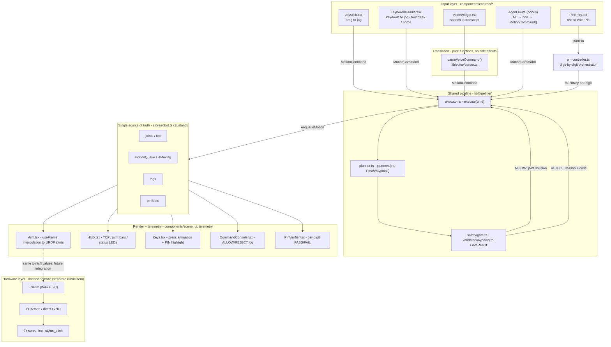
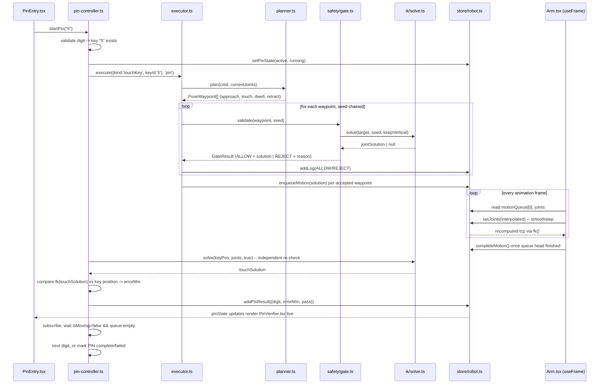
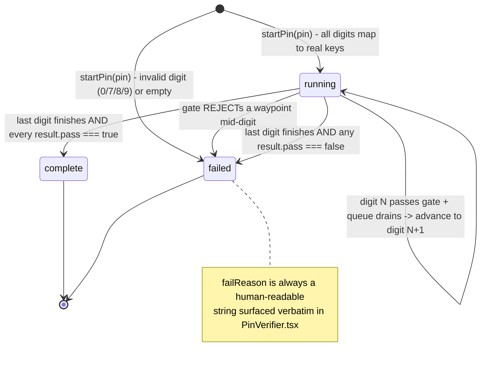
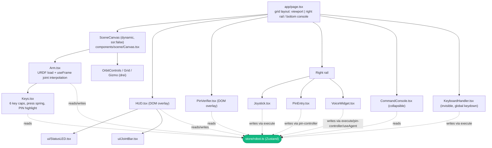

# System Architecture & Concept Explanation
### Greenlight — Vantage Arm Control Suite

**Repo:** https://github.com/SamisDone/GreenLight-IUT-Techathon-Hackathon

---

## 1. The problem, in one paragraph

Vantage Robotics tests every change to its arm control software on a real
arm — slow, risky, expensive. Greenlight moves that testing entirely into
the browser. Engineers visualize the arm, drive it five different ways, and
prove it can complete a precise task on its own, with no hardware in the
loop. Only software that proves itself safe in simulation earns a shot on
real hardware — hence the name.

---

## 2. The one idea that explains everything

Greenlight is not five separate features bolted together. It is **one
motion-control pipeline, triggered several different ways**:

```
Joystick     -\
Keyboard      -\
Voice         --+--> MotionCommand --> Planner (IK) --> Safety Gate --> Executor --> Arm + Telemetry
Autonomous PIN-/
Agentic NL   -/   (emits the SAME command schema, Zod-validated, gated identically)
```

Every input source produces the same structured command
(`lib/pipeline/types.ts`). Every command passes through the same
deterministic safety check (`lib/safety/gate.ts`). The same executor
(`lib/pipeline/executor.ts`) animates the arm. **Nothing reaches the arm
without passing the gate** — including the AI agent path.

**Why this matters:** if a voice command, an autonomous PIN routine, and a
natural-language agent all flow through the identical validate-then-execute
path, then proving that path safe in simulation means the same software can
be trusted on real hardware later. This directly answers the brief's own
framing: *"only software that passes muster in simulation gets a shot on
real hardware."*

> **Disclosed exception:** the dashboard's raw joint sliders
> (`components/scene/HUD.tsx`, `handleSlider`) call `setJoints()` directly
> and do **not** pass through the gate. This is a deliberate debug/inspection
> affordance — for directly posing the arm to inspect a configuration — not
> one of the five graded input paths. It is documented in full in §9 so it
> is never mistaken for a gap in the safety story.

### 2.1 Layered view



The point of drawing it this way: **every arrow into `PIPELINE` is the same
shape** (`MotionCommand`), and **every arrow out of `STORE`** is the same
read — there is exactly one funnel in and one fan-out, regardless of how
many input methods exist.

---

## 3. Tech stack

| Layer | Choice | Why |
|---|---|---|
| Framework | Next.js 16 (App Router), React 19 | Single deployable web app, no separate backend needed for the simulation |
| 3D rendering | `three`, `@react-three/fiber`, `@react-three/drei` | Declarative scene graph over Three.js; `drei` gives orbit controls, grid, gizmo, HTML-in-3D for free |
| Robot model | `urdf-loader` reading `public/arm.urdf` | Loads the provided URDF directly — joint names, meshes, and limits come from one source of truth |
| State | `zustand` (`store/robot.ts`) | One small global store, no boilerplate reducers/providers; any component can read/write robot state |
| Validation (agent layer) | `zod` | Validates LLM structured output into `MotionCommand[]` via Zod discriminated unions before it ever reaches the gate |
| Voice input | Web Speech API (`webkitSpeechRecognition`) | Zero-dependency, in-browser, no network call required for the baseline voice requirement |
| Styling | Tailwind CSS v4 + CSS custom properties in `app/globals.css` | Utility classes for layout, design-token variables (`--primary`, `--destructive`, etc.) for anything themed |
| LLM integration | `ai` (Vercel AI SDK), `@ai-sdk/google` | `generateObject()` with Zod schema validation for structured LLM output; Gemini model called server-side |
| Package manager | Bun (`bun.lock`) and npm (`package-lock.json`) | Project convention per `AGENTS.md` |

---

## 4. Repository map (what lives where)

```
app/
  page.tsx                 Root layout: viewport + right rail + bottom console (grid layout)
  layout.tsx                Fonts (Space Grotesk, JetBrains Mono), page metadata
  api/agent/route.ts         Server route for the agentic bonus layer — Vercel AI SDK `generateObject()` with Gemini

components/
  scene/
    Canvas.tsx               <Canvas> setup: camera, lights, grid, orbit controls, gizmo
    Arm.tsx                  Loads the URDF, drives the per-frame joint interpolation loop
    Keys.tsx                 The 6-key panel mesh: press animation, PIN highlight, contact flash
    HUD.tsx                  TCP readout, status LEDs, joint bars/sliders overlay
    PinVerifier.tsx           Per-digit PASS/FAIL overlay during an autonomous PIN run
    ReachEnvelope.tsx         Stub — planned reach-envelope wireframe (not implemented)
  controls/
    Joystick.tsx              XY pad + Z slider → continuous jog commands
    KeyboardHandler.tsx        Invisible component; global keydown → MotionCommand
    PinEntry.tsx               PIN text input + Run/Stop, drives lib/panel/pin-controller.ts
    VoiceWidget.tsx            Mic toggle + KEYWORD/AGENT mode switch, drives lib/voice/* and lib/agent/*
    ModeSwitch.tsx             Stub — planned manual/auto/voice/agent mode toggle (not implemented)
  telemetry/
    CommandConsole.tsx         Collapsible ALLOW/REJECT log (the shared audit trail)
    JointBars.tsx, Readout.tsx Stubs — superseded by components/ui/JointBar.tsx & StatusLED.tsx
  ui/
    JointBar.tsx               Actually-used limit-aware joint bars (rendered inside HUD)
    StatusLED.tsx              Actually-used MODE / GATE / SIM status dots
    CornerBrackets.tsx          Small decorative UI primitive

lib/
  pipeline/
    types.ts                  The shared contract: MotionCommand, PoseWaypoint, GateResult, ExecReport
    planner.ts                 MotionCommand → PoseWaypoint[] (the "what should happen" compiler)
    executor.ts                 Orchestrator: plan → validate (chained) → enqueue → log
  safety/gate.ts               Pure validate(waypoint): GateResult — reach, limits, ground plane
  ik/solve.ts                  Numerical IK — yaw + planar CCD, vertical-stylus + general modes
  robot/
    constants.ts                All physical constants: joint limits, link lengths, key positions
    fk.ts                       Pure forward kinematics (joint angles → TCP position)
  panel/
    keys.ts                     Stub — PIN digit → key validation notes
    pin-controller.ts           Orchestrates a full autonomous PIN run, digit by digit
  voice/
    parser.ts                   Deterministic transcript → MotionCommand (regex/keyword based)
    useVoice.ts                  React hook wrapping Web Speech API (used by VoiceWidget)
    capture.ts                   Unused — an earlier non-hook wrapper, superseded by useVoice.ts
  agent/
    client.ts                    Stub — earlier planned non-hook client, superseded by useAgent.ts
    prompt.ts                    System prompts for LLM: robot description, command types, rules, examples
    schema.ts                    Zod schemas: MotionCommandSchema, AgentResponseSchema, AgentSummarySchema
    useAgent.ts                  React hook: 3-phase flow (parse → execute → summarize → speak via speechSynthesis)

store/robot.ts                 The single Zustand store every module reads/writes

public/
  arm.urdf                     7-actuated-joint arm model (source of truth for the physical rig)
  key.config.json               Key panel layout (positions for keys "1".."6")

docs/
  schematic/                   Electrical schematic doc, pin map, Wokwi sim, sketch.ino (separate 5% rubric item)
  System Architecture & Concept Explanation.md   This document
```

---

## 5. The shared contract

Every input source is only allowed to emit one of these
(`lib/pipeline/types.ts`):

```ts
type MotionCommand =
  | { kind: 'jog'; axis: 'x' | 'y' | 'z'; delta: number }        // Cartesian nudge (meters)
  | { kind: 'moveTo'; target: Vec3; keepVertical?: boolean }      // absolute stylus tip target
  | { kind: 'rotateJoint'; joint: number; deltaDeg: number }      // e.g. rotate base 30°
  | { kind: 'touchKey'; keyId: string }                           // approach, descend, retract
  | { kind: 'enterPin'; pin: string }                             // compiles to touchKey[]
  | { kind: 'home' };
```

No input source is allowed to set joint angles or Three.js transforms
directly (the HUD debug sliders are the one deliberate, disclosed
exception — §2, §9). Everything else goes:

```
MotionCommand  ──plan()──>  PoseWaypoint[]  ──validate()──>  GateResult  ──enqueue──>  motionQueue
```

`PoseWaypoint` is either a `cartesian` target (with an optional
"keep stylus vertical" flag) or a raw `joint` configuration — the two
shapes the safety gate knows how to check.

---

## 6. Walking through one command, end to end

This is the single flow that proves the whole system, because it touches
every stage. Example: an operator types PIN `"5"` and presses Run.

1. **Input** (`PinEntry.tsx`) — calls `startPin("5")`
   (`lib/panel/pin-controller.ts`).
2. **Orchestration** — `pin-controller` validates every digit maps to a real
   key (only `"1"`–`"6"` are wired; `0/7/8/9` are rejected up front with a
   clear reason), sets `pinState.active = true`, then calls
   `execute({ kind: 'touchKey', keyId: '5' }, 'pin')`.
3. **Planner** (`lib/pipeline/planner.ts`) — compiles `touchKey` into a
   waypoint sequence: optionally *prepare* (tilt 60° and flip the stylus
   down, skipped if already vertical), *pre-approach*, *approach*
   (`z = 0.12`), *touch* (`z = 0.05`), *dwell*, *retract*.
4. **Safety gate**, once per waypoint (`lib/safety/gate.ts`) — checks the
   target is within `REACH_MAX * 0.97` of the shoulder, above the ground
   plane, that the IK solver (`lib/ik/solve.ts`) converges, and that every
   resulting joint angle is inside its URDF limit. IK solutions are chained:
   each waypoint's solver seeds from the previous waypoint's solution, so
   the arm doesn't "reset" its posture guess mid-sequence.
5. **Executor** (`lib/pipeline/executor.ts`) — on `ALLOW`, pushes the
   solved joint vector into `motionQueue` and logs `ALLOW` to the shared
   `logs` array (visible in `CommandConsole`). On `REJECT`, it stops
   processing remaining waypoints for that command and logs the reason.
6. **Animation** (`components/scene/Arm.tsx`, `useFrame`) — pops the front
   of `motionQueue`, interpolates every joint from its current value to the
   target using a smoothstep easing curve over a duration derived from the
   slowest joint's velocity limit, and writes the interpolated pose back to
   the store every frame via `setJoints()`.
7. **Telemetry** — `setJoints()` also recomputes the TCP via forward
   kinematics (`lib/robot/fk.ts`); `HUD.tsx` and `Keys.tsx` re-render off
   that same store value, so the 3D key cap visibly presses down and
   flashes the moment the stylus tip enters its 3 cm proximity threshold.
8. **Verification** (`pin-controller.ts`) — once the queue drains, it
   independently re-solves IK for the touch position and compares the
   resulting TCP to the key's true position; if the error is under 5 mm it
   records a `PASS`, otherwise a `FAIL`. `PinVerifier.tsx` renders this
   per-digit result live over the viewport.
9. **Next digit / completion** — the controller subscribes to the store and
   waits for `isMoving === false && motionQueue.length === 0` before
   advancing to the next digit, or marking the whole PIN `complete` /
   `failed`.

### 6.1 Sequence diagram



---

## 7. State management — the single source of truth

`store/robot.ts` (Zustand) is the one place robot state lives:

| Field | Written by | Read by |
|---|---|---|
| `joints: number[]` | `Arm.tsx` (per-frame interpolation), `HUD.tsx` (debug sliders) | `Arm.tsx` (URDF), `HUD.tsx`, `JointBar.tsx`, `Keys.tsx` (via `tcp`) |
| `tcp: Vec3` | Derived automatically inside `setJoints()` via `fk()` | `HUD.tsx`, `Keys.tsx` (proximity/press), `pin-controller.ts` |
| `mode` | `pin-controller.ts` (`'ik'` / `'idle'`) | `StatusLED.tsx` |
| `logs: LogEntry[]` | `executor.ts`, `pin-controller.ts`, `KeyboardHandler.tsx`, `VoiceWidget.tsx` | `CommandConsole.tsx`, `StatusLED.tsx` (gate color) |
| `motionQueue: number[][]` | `executor.ts` (enqueue), `Arm.tsx` (drain) | `Arm.tsx`, `HUD.tsx` (moving indicator) |
| `isMoving` | `enqueueMotion` / `completeMotion` / `clearQueue` | `HUD.tsx`, `pin-controller.ts` (advance gate) |
| `pinState` | `pin-controller.ts` | `PinEntry.tsx`, `PinVerifier.tsx`, `Keys.tsx` (active-key highlight) |
| `safetyFlag` | *(never written — dead field)* | *(unused)* |

Because every visual surface reads from this one store, there is exactly
one place to check if the "same telemetry everywhere" claim is true: does
`joints`/`tcp` change? If yes, the 3D arm, the HUD numbers, the joint bars,
and the key-press animation all move together, because they're all
subscribed to the same slice.

---

## 8. The six input sources, in detail

### 8.1 Joystick — `components/controls/Joystick.tsx`
An XY drag pad plus a vertical Z slider. While dragging, an 80 ms interval
timer reads the current knob displacement and calls
`execute({ kind: 'jog', axis, delta }, 'joystick')` repeatedly — so holding
the knob at full deflection produces a steady stream of small jogs rather
than one large jump. Releasing the knob snaps it back to center and stops
the timer.

### 8.2 Keyboard — `components/controls/KeyboardHandler.tsx`
An invisible component that attaches a single global `keydown` listener.
Guards against firing while a text input is focused
(`isInputFocused()`). Maps: `1`–`6` → `touchKey`, arrow keys → `jog` on
X/Y, `PageUp`/`PageDown` → `jog` on Z, `Escape` → emergency stop
(`clearQueue()`), `Home` → clear queue + `home` command.

### 8.3 Autonomous PIN — `components/controls/PinEntry.tsx` + `lib/panel/pin-controller.ts`
The highest-weighted rubric item (20%). A free-text numeric field feeds
`startPin(pin)`, which is a self-driving state machine (not a single
`execute()` call) — it validates all digits up front, then runs one
`touchKey` per digit sequentially, gated by store subscription so it never
starts digit *N+1* before digit *N*'s motion has fully settled. Every digit
gets an independently-measured millimeter error against a 5 mm pass
threshold (`PASS_THRESHOLD_MM` in `pin-controller.ts`), matching the
brief's own success definition.

**`pinState.phase` lifecycle:**



### 8.4 Voice — `components/controls/VoiceWidget.tsx` + `lib/voice/*`
Deliberately **not** an LLM. `useVoice.ts` wraps the browser's
`webkitSpeechRecognition` (Chrome-only, degrades gracefully with a message
elsewhere) with auto-restart-on-silence handling. Final transcripts are
handed to `parseVoiceCommand()` (`lib/voice/parser.ts`) — a pure,
dependency-free regex/keyword parser recognizing "home", "enter pin ___",
"touch/press/tap N", "rotate base N degrees [left/right]", and directional
jogs ("move up/down/left/right/forward/back"). Unrecognized phrases return
`command: null` and are logged as a `REJECT` with the raw transcript as the
reason — nothing is guessed. `lib/voice/capture.ts` is an earlier,
non-hook implementation of the same idea and is currently dead code,
superseded by `useVoice.ts`.

### 8.5 Agentic natural language (bonus, +10%) — `components/controls/VoiceWidget.tsx` (agent mode) + `lib/agent/*` + `app/api/agent/route.ts`
The agentic layer is fully implemented and wired into the shared pipeline.

**Architecture:** a 3-phase flow — parse, execute, summarize — with the LLM
called server-side so the API key never reaches the client.

1. **Parse** — the user's spoken transcript is sent to `POST /api/agent`
   (`action: 'parse'`). The server route calls `generateObject()` (Vercel AI
   SDK) with a Gemini model, a system prompt describing the robot and all
   available commands (`lib/agent/prompt.ts`), and a Zod schema
   (`lib/agent/schema.ts`) that validates the output into
   `{ commands: MotionCommand[], reply: string }`. Malformed output is
   rejected by Zod before any command reaches the pipeline.

2. **Execute** — `useAgent.ts` iterates over the validated `commands[]`,
   calling `execute(cmd, 'agent')` for each one — the same function used by
   joystick, keyboard, and voice. Each command passes through `plan()` →
   `validate()` → `enqueueMotion()` identically. Results (success/reject +
   reason) are collected.

3. **Summarize** — the execution results are sent back to `POST /api/agent`
   (`action: 'summarize'`). A second `generateObject()` call produces a
   concise spoken reply that includes what succeeded and, critically, *why*
   any commands failed (the gate's rejection reason, verbatim). The reply is
   spoken aloud via `window.speechSynthesis`.

**Ambiguity handling:** if the instruction is vague or ambiguous, the LLM
returns an empty `commands[]` array and a clarifying question in `reply`.
No commands are executed, and the question is spoken to the operator.

**UI:** `VoiceWidget.tsx` has a pill-style `KEYWORD` / `AGENT` toggle.
In keyword mode, transcripts go to the deterministic `parseVoiceCommand()`
parser (§8.4). In agent mode, transcripts go to `useAgent.process()`. Both
modes share the same mic button and Web Speech API hook (`useVoice`).
Agent mode shows a chat-style message history (user + arm responses).

**Key constraint preserved:** the agentic layer emits `MotionCommand[]` —
the same contract as every other input source. It never sets raw joint
angles. Every command passes the identical gate. An ungated agent path does
not exist.

### 8.6 (Not one of the five) Dashboard joint sliders — `components/scene/HUD.tsx`
A debug/inspection affordance for directly posing the arm by dragging
per-joint sliders. Calls `setJoints()` straight through, bypassing
`plan()`/`validate()`. Documented here so it is never confused with a
gated input path — see §2 and §9.

---

## 9. Known gaps and stub files

What's built vs. scaffolded, stated explicitly — the same reasoning behind
the electrical schematic doc's disclosure of its Wokwi simulation
limitations.

| File | Status |
|---|---|
| `lib/agent/client.ts` | Stub — earlier planned non-hook client, superseded by `useAgent.ts` |
| `components/controls/ModeSwitch.tsx` | Stub, not rendered in `app/page.tsx` |
| `components/scene/ReachEnvelope.tsx` | Stub, not rendered in `Arm.tsx`/`Canvas.tsx` |
| `components/telemetry/JointBars.tsx`, `components/telemetry/Readout.tsx` | Stubs, superseded by the actually-used `components/ui/JointBar.tsx` and `components/ui/StatusLED.tsx` |
| `lib/voice/capture.ts` | Dead code — superseded by `lib/voice/useVoice.ts` |
| `lib/panel/keys.ts` | Stub — PIN digit validation for `0/7/8/9` is currently implemented inline inside `pin-controller.ts`, not here |
| `store/robot.ts` → `safetyFlag` | Declared, initialized, never written or read — currently inert |
| `components/scene/HUD.tsx` joint sliders | Bypasses the safety gate by design (§2, §8.6) — the only path that does |

None of these affect the six wired input paths (joystick,
keyboard, voice, autonomous PIN, agentic NL) or the gate/planner/executor/IK core,
which are fully implemented and exercised end to end.

---

## 10. The kinematic model

### 10.1 Forward kinematics — `lib/robot/fk.ts`
Pure matrix math (no Three.js). Walks the 7 joints in `lib/robot/constants.ts`
in order, each contributing a translation along local +Z by its `offset`
and then a rotation about its declared axis (`z` or `y`) by its current
angle, finishing with a fixed `TCP_OFFSET` for the stylus tip. Produces
every intermediate joint position plus the final TCP — used both to render
telemetry and, indirectly, to seed IK.

### 10.2 Inverse kinematics — `lib/ik/solve.ts`
The arm's axes split cleanly: `J1`/`J4`/`J6` rotate about Z, `J2`/`J3`/`J5`/`stylus_pitch`
about Y. Holding the two Z-axis "roll" joints (`J4`, `J6`) at zero reduces
the problem to **yaw (J1) + a 4-link planar chain** — fast, stable, and
easy to reason about live:

**Kinematic chain, side view (the (r, z) plane after J1 yaw is factored out):**

```
        z
        |
        |        J7 = stylus_pitch (Y-axis, orientation joint)
        |        .
        |       /  \  PLANAR_LINKS[3] = 0.137 m (stylus)
        |      /    \
        |     J5 --- tip (stylus_tip, TCP)
        |    /
        |   /  PLANAR_LINKS[2] = 0.400 m
        |  /
        | J3
        |/
        J2  <- SHOULDER pivot, z = 0.310 m  (PLANAR_LINKS[0] = 0.250 m to J3,
        |                                     PLANAR_LINKS[1] = 0.400 m J3->J5)
        |
   ─────┼───────────────────────────────────  r  (radial distance from base axis)
     base (J1 = yaw about Z, out of this plane)

  J4, J6 (Z-axis "roll" joints) are held at 0 — they rotate the plane itself,
  not a point within it, so they drop out of the 2D solve entirely.
```

Solve order:

1. `J1 = atan2(target.y, target.x)` — solved directly, no iteration.
2. The remaining problem is 2D: distance `r` from the base axis and height
   `z`.
3. **Vertical-stylus mode** (used whenever a waypoint sets
   `keepVertical: true`, e.g. every key touch): solves a 3-link CCD chain
   for `J2`/`J3`/`J5` against a "wrist" target offset upward by the stylus
   length, then sets `J7` (`stylus_pitch`) so the cumulative tilt equals
   π — i.e. the stylus always points straight down at the moment of
   contact, without any separate orientation solver.
4. **General mode** (jogs, free `moveTo`): plain 4-link CCD over
   `J2`/`J3`/`J5`/`J7` with no orientation constraint, used as the fallback
   if vertical mode's wrist-only solve fails.
5. Both modes warm-start from the previous joint solution (`seed`) so
   consecutive waypoints converge in very few iterations and don't jump to
   a discontinuous alternate solution.

Numerical, not closed-form — chosen because CCD is simple to verify by
inspection and cheap enough to re-run every waypoint, at the cost of only
being a local solver (no discontinuity guard beyond the joint-limit clamp
already in the loop).

### 10.3 Why all 7 joints, including `stylus_pitch`
The provided URDF defines `stylus_pitch` as an actuated revolute joint, not
a fixed tip. Treating it as such lets the vertical-stylus IK mode keep the
nib normal to the key surface automatically at every touch, instead of
requiring separate orientation compensation logic. This is a deliberate,
documented departure from the brief's literal "6-DOF" framing — see the
electrical schematic doc (`docs/schematic/README.md`, §2.1) for the same
decision restated from the hardware side.

---

## 11. The safety gate — the system's center of gravity

`lib/safety/gate.ts` exports one pure function, `validate(waypoint,
currentJoints?)`, with no side effects and no dependency on UI, timers, or
network. Every `PoseWaypoint`, from every source, passes through it before
a single joint value is queued for animation.

- **Cartesian waypoints:** reachability (straight-line distance from the
  shoulder pivot must be within 97% of `REACH_MAX = 1.19 m`, leaving margin
  before the numerical edge of the workspace), ground-plane check
  (`z ≥ 0`), IK convergence, then a per-joint limit check on the resulting
  solution.
- **Joint waypoints:** per-joint limit check directly against
  `lib/robot/constants.ts`, plus a forward-kinematics ground check (a
  raw joint target could still push the TCP below the floor even if every
  individual joint is within its own range).

Return type is a discriminated union (`GateResult`) carrying either the
accepted joint solution or a machine-readable rejection `code`
(`UNREACHABLE` / `JOINT_LIMIT` / `OUT_OF_BOUNDS` / `MALFORMED`) plus a
human-readable `reason` string, which is what shows up, unmodified, in the
Command Console and in the voice widget's spoken/printed feedback.

---

## 12. Rendering pipeline

### 12.1 Component render tree



- **`Canvas.tsx`** sets up the `@react-three/fiber` scene: two directional
  lights + ambient fill, an infinite reference grid, damped orbit controls,
  and a bottom-right axis gizmo.
- **`Arm.tsx`** loads `public/arm.urdf` once via `urdf-loader`
  (StrictMode-safe load guard), parents the loaded robot under its own
  `<group>`, and owns the single `useFrame` loop that (a) advances the
  motion-queue interpolation described in §6 step 6, and (b) applies the
  resulting joint angles onto the URDF's actual joint objects every frame.
- **`Keys.tsx`** renders the six key caps as boxes positioned from
  `KEYS` in `lib/robot/constants.ts` (mirrored in `public/key.config.json`
  for firmware-side reference). A single shared `useFrame` drives every
  key's press-depth spring (triggered purely by TCP-to-key distance, not by
  which command is executing) and a lime highlight + white contact-flash
  specifically tied to `pinState.activeKeyId` during an autonomous run.
- **`HUD.tsx`** is plain absolutely-positioned DOM overlaid on the
  viewport (not a 3D overlay) — TCP readout, status LEDs
  (`ui/StatusLED.tsx`), and a togglable joint-bars/joint-sliders panel
  (`ui/JointBar.tsx`).
- **`PinVerifier.tsx`** is a second DOM overlay, top-right, showing live
  per-digit PASS/FAIL state during a PIN run.

---

## 13. Electrical / hardware layer

The physical control layer is a separate, self-contained document:
**`docs/schematic/README.md`** (with `diagram.json` and `sketch.ino`
alongside it, plus a public Wokwi simulation). Summary of how it connects
to this software architecture:

```
Layer 1 (external):  Browser (this app)  --WiFi/HTTP-->  ESP32
Layer 2 (internal):  ESP32               --I2C-------->  PCA9685 (production) or direct GPIO (Wokwi sim)
Layer 3 (analog):    PCA9685 / GPIO      --PWM-------->  7x servo (one per URDF joint, incl. stylus_pitch)
```

The same joint-limit values in `lib/robot/constants.ts` are cross-checked
against the firmware's `jointLimits[]` array (`docs/schematic/README.md`
§3.4), and the firmware runs its own independent `isWithinLimit()` check —
so an out-of-range command is rejected twice: once by this app's gate, and
again, defense-in-depth, at the firmware boundary regardless of where the
command originated (including a future agentic layer).

---

## 14. Why the architecture is shaped this way

| Decision | Reasoning | Trade-off |
|---|---|---|
| One shared `MotionCommand` contract | Adding a new trigger never means rewriting motion logic — just a thin translator into an existing, tested contract | The contract must stay stable once defined; changing it means re-checking every trigger |
| Safety gate as a first-class, reused module | It is the center of the system, not a wrapper added at the end. The brief explicitly marks down an "ungated agent" — this design makes that impossible by construction | Adds one more hop of latency to every single command, even simple jogs |
| Numerical IK: base yaw + planar decomposition | The arm's axes split cleanly — J1/J4/J6 are Z-axis, J2/J3/J5/J7 are Y-axis. Holding the two rolls at zero reduces the problem to yaw + a 4-link planar chain: fast, stable, explainable | Relies on this specific axis layout; a general solver over all 7 joints would be needed if the layout changed |
| Control all 7 actuated joints (including stylus_pitch) | The provided URDF makes the stylus pitch an actuated joint, not fixed. Using it keeps the nib pointing straight down at every key touch automatically | Departs from the brief's literal "6-DOF" wording — stated here as a deliberate, documented choice, not a miss |
| Deterministic voice kept separate from the agentic layer | The required baseline (keyword to motion) must work with zero dependency on any model or network, and is judged on its own | Two voice code paths coexist in the same widget (KEYWORD/AGENT toggle) but are independent — disabling the LLM leaves the deterministic path fully operational |
| Agent emits the same schema, gated identically | The LLM never produces raw joint angles — only validated high-level commands, Zod-checked before `execute()` | Adds latency (~1–2s per LLM call) and API cost; isolated entirely to the optional bonus path |
| Kinematic touch check (no physics engine) | The brief defines success as the tip reaching within 5mm of a key — a physics simulation adds engineering risk with no scored value | No contact-force modeling; explicitly out of scope by design |
| Single Zustand store, no per-feature state | Every surface (3D scene, HUD, console, PIN overlay) renders off one source of truth, so "the same telemetry everywhere" is structurally true, not just visually similar | Any bug in `setJoints()`/`fk()` propagates to every consumer at once — there is no isolation between telemetry and control state |

---

## 15. How this maps to the rubric

| Rubric criterion | Where it lives in this architecture |
|---|---|
| Visualization & Dashboard (15%) | 3D scene (`Canvas.tsx`, `Arm.tsx`) + live joint/end-effector telemetry (`HUD.tsx`), fed by the same `store/robot.ts` every other module reads |
| Inverse Kinematics (15%) | `lib/ik/solve.ts` + the Planner stage (`lib/pipeline/planner.ts`) — any reach target resolving smoothly is the proof |
| Manual Control (10%) | `Joystick.tsx` and `KeyboardHandler.tsx` — two thin translators into the shared jog/touchKey commands, nothing built twice |
| Voice Control (15%) | `lib/voice/parser.ts` — deterministic keyword parser feeding the identical `MotionCommand` schema |
| Autonomous PIN Entry (20%, highest weight) | `lib/panel/pin-controller.ts` — `enterPin` compiled to a sequence of gated `touchKey` commands, each with a measured mm-tolerance check |
| Electrical Schematic (5%) | Separate document — `docs/schematic/README.md` — pin map, power domains, PCA9685 reasoning |
| System Architecture & Concept (15%, this document) | This pipeline description, the diagrams, the rationale table, and the known-gaps list (§9) |
| Agentic bonus (+10%) | `app/api/agent/route.ts` (server-side Gemini via Vercel AI SDK) + `lib/agent/{schema,prompt,useAgent}.ts` (Zod validation, system prompts, 3-phase client hook) + `VoiceWidget.tsx` KEYWORD/AGENT toggle — **fully implemented**, emitting the same validated commands, gated identically, with spoken natural-language feedback |

---
